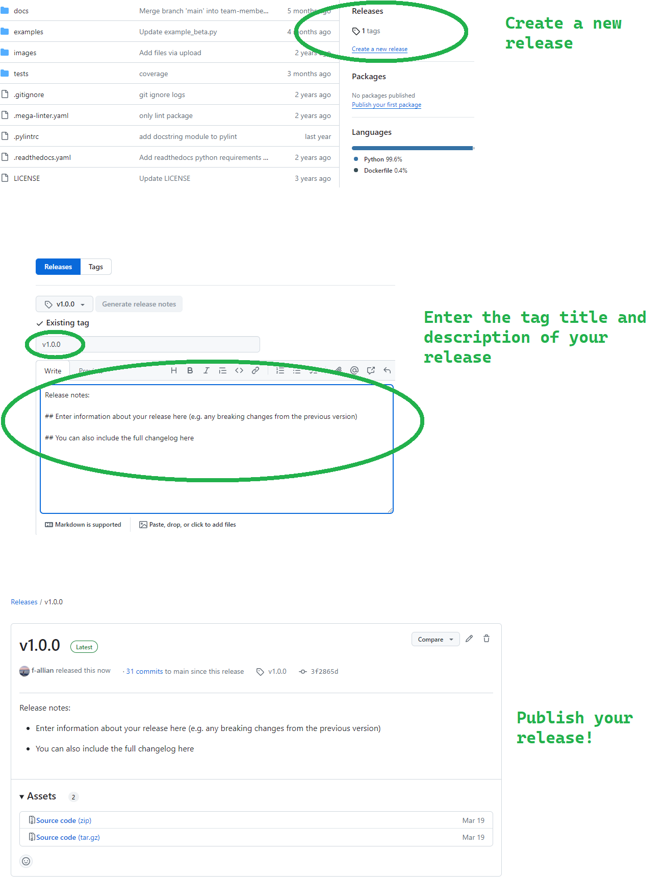
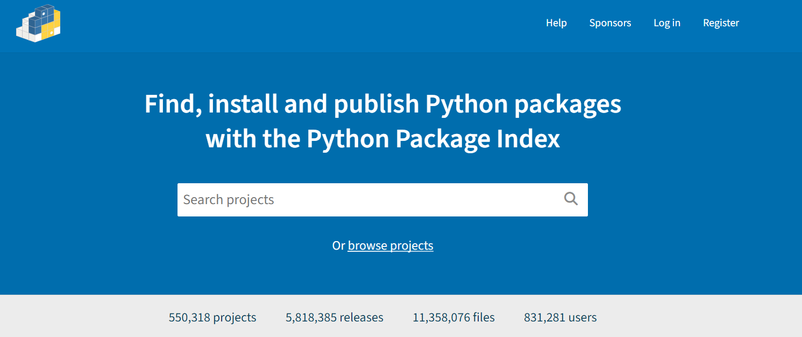
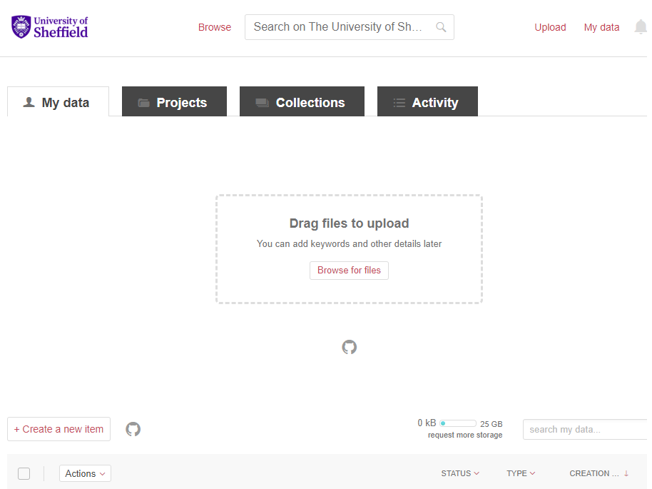

:::::::::::::::::::::::::::::::::::::: questions

- How can you prepare your software for releasing and publishing on different platforms?
- How can GitHub's automation tools help with publishing your software?
- What are the benefits of publishing your software on PyPI and ORDA?

::::::::::::::::::::::::::::::::::::::::::::::::

::::::::::::::::::::::::::::::::::::: objectives

- Understand the significance of releasing and publishing your software in the context of FAIR4RS.
- Learn how to publish your software to PyPI and The University of Sheffield's ORDA repository.

::::::::::::::::::::::::::::::::::::::::::::::::

## Preparing to Publish

Now that we have covered the fundamentals of packaging in Python, we can start preparing to publish the package online for others to use. But before we do, we need to make sure our package contains the necessary files. To recap, let's review the basic directory we created back in episode one, which had the following structure:


```
📦 my_project/
├── 📂 my_package/
│ └── 📄 init.py
├── 📂 tests/
├── 📂 docs/
│ └── 📄 documentation.md
├── 📄 pyproject.toml
├── 📄 README.md
└── 📄 LICENSE
```

### README 

Firstly, all packages must contain a `README.md` file that explains what the project is. how users can install it and how they can use it. A good example of a `README.md` file may look something like:

```

# My Python Project

My Python Project is a simple utility tool designed to perform basic operations on text files. Whether you need to count words, find specific phrases, or extract data, this tool has you covered.

## Installation

You can install My Python Project via pip:

$ pip install my-python-project

## Usage

from my_python_project import text_utils

text = "Lorem ipsum dolor sit amet, consectetur adipiscing elit."
word_count = text_utils.count_words(text)
print("Word count:", word_count)

This will output:

Word count: 9

```

Notice that the `README.md` should be included at the top level of our project directory. If your package was created using a `.toml` file, it should also be included in the metadata by adding in the following line:

``` toml

[project]
readme = "README.md"

```

::::::::::::::::::::::::::::::::::::: callout

In the `README.md` file, developers also usually include in a "contributing" section for new users that are typically outside of the project. The purpose of this section is to encourage new developers to work on the project, while ensuring they follow the etiquette set by the project developers. This may look something like:

```
### Contributing

Contributions to My Python Project are welcome! If you'd like to contribute, please follow these steps:

1. Fork the repository.
2. Create a new branch for your feature (git checkout -b feature/new-feature).
3. Make your changes and ensure tests pass.
4. Commit your changes (git commit -am 'Add new feature').
5. Push to the branch (git push origin feature/new-feature).
6. Create a new Pull Request.
```

::::::::::::::::::::::::::::::::::::::::::::::::


### Licensing 

Following this, it is essential for your software to have a license to emphasise to users what their rights are in regards to usage and redistribution. The purpose of this is to provide the developer with some legal protections, if needed. There are many different open source licenses available, and it is up to the developer(s) to choose the appropriate license. You can explore alternative open source licenses at [www.choosealicense.com](www.choosealicense.com). It is important to note that your selection of license may be constrained by the licenses of your dependencies. 

The most common license used in open source projects is the [MIT license](https://en.wikipedia.org/wiki/MIT_License). The MIT license is permissive, which allows users to freely use, modify, and distribute software while providing a disclaimer of liability.

::::::::::::::::::::::::::::::::::::: callout

The MIT License has the following terms:

Copyright (c) <year> <copyright holders>

Permission is hereby granted, free of charge, to any person obtaining a copy of this software and associated documentation files (the "Software"), to deal in the Software without restriction, including without limitation the rights to use, copy, modify, merge, publish, distribute, sublicense, and/or sell copies of the Software, and to permit persons to whom the Software is furnished to do so, subject to the following conditions:

The above copyright notice and this permission notice shall be included in all copies or substantial portions of the Software.

THE SOFTWARE IS PROVIDED "AS IS", WITHOUT WARRANTY OF ANY KIND, EXPRESS OR IMPLIED, INCLUDING BUT NOT LIMITED TO THE WARRANTIES OF MERCHANTABILITY, FITNESS FOR A PARTICULAR PURPOSE AND NONINFRINGEMENT. IN NO EVENT SHALL THE AUTHORS OR COPYRIGHT HOLDERS BE LIABLE FOR ANY CLAIM, DAMAGES OR OTHER LIABILITY, WHETHER IN AN ACTION OF CONTRACT, TORT OR OTHERWISE, ARISING FROM, OUT OF OR IN CONNECTION WITH THE SOFTWARE OR THE USE OR OTHER DEALINGS IN THE SOFTWARE.

::::::::::::::::::::::::::::::::::::::::::::::::

As with the `README.md`, you can also add the license to your `pyproject.toml` file as:

``` toml

[project]
license = {file = "LICENSE"}

```

## Creating Releases of your Software

Once you have prepared all of the material above, you will be in a good position to release your software to an online repository. The most common platform to host your software packages is on GitHub, which uses `git` as the underlying tool to version control your code (note; alternatives are GitLab, BitBucket and SourceForge). 

While the terms `releasing` and `publishing` are commonly used interchangeably, in this course, `releasing` refers to making a version of the software available for download and use, whereas `publishing` refers to the formal announcement and distribution of the software to a wider audience on a platform or marketplace. 

### Manual Releasing using Git Tags

On GitHub, it is a relatively simple process to create a release of your software by using `Git tags`. `Git tags` are a way of permanently tagging a specific point in your repository's history, which can be used to denote a version that is suitable for others to use. A tag is an immutable reference to a commit (or series of commits), making it simple to identify specific versions of a software, and the tags are commonly identified in conjunction with the Semantic Versioning framework (e.g. v1.0.0). For more information about how GitHub uses tags for software releases, see [releases](https://docs.github.com/en/repositories/releasing-projects-on-github/about-releases).

In general, tagging a release is a 2 step process using Git:

1. Create a tag of a specific point in your software package's history using the `git tag` command that is denoted by a specific version, and upload it to your remote repository using `git push`.

2. Based on your tag, create a release on GitHub of the relevant files in your repository (usually a **zip** or **tar.gz** file), which allows users to download the specific release of your software that corresponds to the time you created your tag.

Collectively, the 2 steps process would look something like:

```bash
$ git tag v1.0.0

$ git push --tags

```
Once you've pushed your tag, you can create a release with the tag you pushed to your remote repository by the following:


<figure style="text-align: center;">
    
    <figcaption><em>Figure 1: Workflow describing how to release a package on GitHub.</em>.</figcaption>
</figure>

::::::::::::::::::::::::::::::::::::: callout

### Deleting a Release

You can also delete a release if you make an error using the following commands:

```bash
$ git tag -d v1.0.0
$ git push origin :refs/tags/v1.0.0

```

The first line simply deletes the tag `v1.0.0` in your local repository, whereas the second line deletes the `v1.0.0 tag` from the remote repository named origin. Note that the colon indicates that you are not pushing any new content to replace the tag; instead, you are specifying that the tag should be deleted. Once you have ran the lines above, you will receive confirmation that the tag has been deleted.


::::::::::::::::::::::::::::::::::::::::::::::::


::::::::::::::::::::::::::::::::::::: challenge

## Challenge 1: Should you always delete a release?

Why might it not be advisable to delete a tag or release, and what alternative actions could you consider instead?

:::::::::::::::::::::::: hint

## Hint

Think about the impact of deleting a tag or release in version control. How might you preserve historical data while managing updates to tags and releases?

:::::::::::::::::::::::::::::::::

:::::::::::::::::::::::: solution

## Solution

Deleting a tag or release in a version control system can disrupt historical tracking and cause confusion for current and future collaborators. Instead of outright deletion, consider tagging the correct commit with a new version number or marking the tag as deprecated with clear documentation. This maintains historical integrity while clarifying the correct state of the codebase. Additionally, communicating changes effectively with team members ensures everyone understands the correct usage of tags and releases for your project.

:::::::::::::::::::::::::::::::::
::::::::::::::::::::::::::::::::::::::::::::::::

### Automated Releases using Actions

Before wrapping up this section, it is important to highlight that you can also automate your releases on GitHub using Actions, saving you time and helping you release new versions of your package quickly. Since GitHub Actions is a CI/CD platform that allows developers to automate certain aspects of their workflows (such as builds, tests, deployments), we can also configure a release pipeline that is defined by a workflow file (in YAML format) that run whenever a change is made to your repository.

::::::::::::::::::::::::::::::::::::: callout

Recall that GitHub uses the `.github` directory to store configuration files that are specific to GitHub features and integrations, and keeps the repository organised by separating these files from the main source code. Notice that it is common convention that the `.github` folder is a hidden directory. 


The `.github/workflows` directory is the designated place where GitHub looks for workflow files. By placing your workflow files in `.github/workflows`, you enable GitHub Actions to automatically detect and run the workflows based on the triggers you specify (such as a push, pull request, or tag creations).

::::::::::::::::::::::::::::::::::::::::::::::::


::::::::::::::::::::::::::::::::::::: callout

As a reminder, here are some of the common variables used in GitHub Actions workflow files:

| Variable    | Description                                                                                                                                                     |
|-------------|-----------------------------------------------------------------------------------------------------------------------------------------------------------------|
| `name`      | Specifies the name of the workflow. It helps identify the workflow in the GitHub Actions UI and in logs.                                                       |
| `on`        | Defines the event that triggers the workflow, such as `push`, `pull_request`, `schedule`, or custom events like `workflow_dispatch`.                            |
| `jobs`      | Contains one or more jobs to be executed in parallel or sequentially. Each job represents a set of steps that run on the same runner.                           |
| `runs-on`   | Specifies the type of machine or virtual environment where jobs will run, such as `ubuntu-latest`, `windows-latest`, or `macos-latest`.                           |
| `steps`     | Defines the sequence of tasks to be executed within a job. Each step can be a shell command, an action, or a series of commands separated by newlines (`run`).   |
| `env`       | Sets environment variables that will be available to all steps in a job.                                                                                       |
| `with`      | Specifies inputs or parameters for an action or a specific step.                                                                                                |
| `uses`      | Specifies the action to be used in a step. It can refer to an action in a public repository, a published Docker container, or a specific path in the repository.  |
| `id`        | Specifies a unique identifier for a step or action output, which can be referenced in subsequent steps or actions (`outputs`).                                 |
| `secrets`   | Allows access to encrypted secrets, such as `GITHUB_TOKEN`, which is automatically generated and scoped to the repository, used for authenticating GitHub API requests. |
                                                                       

::::::::::::::::::::::::::::::::::::::::::::::::


There are several workflow extensions already present on GitHub that you can use in your configuration file to automate your releases (e.g. [action-gh-release](https://github.com/marketplace/actions/gh-release)). An example workflow file to automatically trigger a new release based on a push could look something like:

```yaml

name: Create Release

on:
  push:
    tags:
      - 'v*'  # Trigger on tags starting with 'v'

permissions:
  contents: write  # Ensure write permissions for the workflow

jobs:
  release:
    name: Create GitHub Release
    runs-on: ubuntu-latest
    steps:
      - name: Checkout code
        uses: actions/checkout@v2  # Checkout the repository's code

      - name: Create Release
        uses: softprops/action-gh-release@v1
        env:
          GITHUB_TOKEN: ${{ secrets.GITHUB_TOKEN }}  # Pass GitHub token to the action
        with:
          tag_name: ${{ github.ref }}  # The full tag name, e.g., refs/tags/v1.0.0
          release_name: Release ${{ github.ref }}  # Release name based on the tag

```

Let's break down what is happening in the above workflow file. 

- The first logic `on.push.tags - 'v*'` ensures the workflow triggers only when a tag starting with v is pushed, which is in line with the Semantic Versioning framework. Following this, we ensure that the workflow has the relevant write permissions to execute the workflow.

- Next, after initiating the operating system environment (`ubuntu-latest`) there are 2 separate steps within the job that are carried out: first, `Checkout code` uses the `actions/checkout@v2` action to fetch the repository's code into the workflow environment. Second, `Create Release` uses the `softprops/action-gh-release@v1` action to automate the creation of a GitHub release. The `GITHUB_TOKEN` environment variable, securely provided through GitHub secrets (`${{ secrets.GITHUB_TOKEN }}`), allows the action to perform repository operations like creating releases. The action is configured with inputs such as `tag_name` and `release_name`, derived dynamically from the Git tag (`${{ github.ref }}`), ensuring each release is appropriately named and described (body: Automated release created by GitHub Actions.). 

Ultimately, a workflow like this streamlines the process of managing releases by automating tasks that would otherwise require manual intervention as we have demonstrated above. Once you have created a file similar to the one above, you can view the status of the workflow in the `Actions` tab as usual.

::::::::::::::::::::::::::::::::::::: challenge

## Challenge 2: Automating Releases

You have been tasked with setting up a GitHub Actions workflow to automate the release process whenever a tag is pushed to your repository. Despite configuring the workflow correctly (`on: push: tags: - 'v*'`), you notice that the release is not being created. Provide a systematic approach to troubleshoot and resolve this issue.

:::::::::::::::::::::::: hint

## Hint

Does GitHub provide a way to view the output logs for a given workflow?

:::::::::::::::::::::::::::::::::

:::::::::::::::::::::::: solution

## Solution

There are several different approaches to debug this workflow. The first place to check would be the output log files from the workflow for any errors or warnings related to event triggers - this will give you a good idea where in your file the error may be arising. Since the error in question is likely due to the push itself, the most obvious line to check is `on: push: tags: - 'v*'` to ensure it correctly triggers on tag pushes starting with `v`, and ensure Semantic Versioning practices are being followed, and that there are no typographical errors. The second most common fault is that the GitHub token (`secrets.GITHUB_TOKEN`) used in your workflow has been incorrectly inputted, and/or may have insufficient permissions (`permissions: contents: write`) to create releases and perform other necessary actions in your repository.

:::::::::::::::::::::::::::::::::
::::::::::::::::::::::::::::::::::::::::::::::::


::::::::::::::::::::::::::::::::::::: callout

Remember to **never** publish any sensitive information, such as passwords, directly on GitHub. Storing sensitive data in your repository makes it publicly accessible (if your repository is public) or easily accessible to anyone with repository access (if private). This can lead to unauthorised access, security breaches, and potential misuse of your code. Instead, use should use GitHub Secrets or environment variables to securely manage the sensitive information, ensuring it is kept safe and only accessible by authorised collaborators or workflows.

::::::::::::::::::::::::::::::::::::::::::::::::


## Publishing your Software

### Python Packaging Index


<figure style="text-align: center;">
    
    <figcaption><em>Figure 2: Screenshot of the main landing page of PyPI. GitHub.</em>.</figcaption>
</figure>

Now that we have covered how to release specific versions of your software, we will turn to how to publish your package on an online repository that allows others to easily install and use you software. [PyPI](https://pypi.org/) (or the Python Packaging Index) is the official package repository for the Python community. It serves as the central location where developers can publish and share their packages, making them easily accessible to the wider community. When we use `pip` to install packages from the command line, it fetches them from PyPI by default. Uploading your packages to PyPI is recommended if you want to distribute your projects widely, as it allows other developers to easily find, install, and use your software.


::::::::::::::::::::::::::::::::::::: callout

Developers often use [TestPyPI](https://test.pypi.org/) for testing and validating packages before they are officially published on PyPI.

::::::::::::::::::::::::::::::::::::::::::::::::

To build the wheels, there are 2 tools that we need to install and use. The first is `build`, which is a command-line tool used to build source distributions, and wheel distributions  of Python projects based on the metadata specified in the `pyproject.toml`. On the other hand, `twine` is the tool we use to securely upload the built distributions to PyPI, which handles tasks like authentication and transfer of package files. 

In practice, the installation and usage of these tools would look something like:

```bash

pip install build 

python -m build

```

This will create `dist/your-project-name-1.0.0.tar.gz` (source distribution) and `dist/your-project-name-1.0.0-py3-none-any.whl` (wheel distribution) in the dist directory. Next, we can use `twine` to securely upload the built distributions to PyPI:

```bash

pip install twine

```

We can also run:

```bash

# Check our files is ready to be uploaded using twine check

twine check dist/*

# Check our package is ready to be uploaded to TestPyPI

twine upload --repository testpypi dist/*

```

Once we have confirmed that everything works as expected on TestPyPI, we may proceed with installing our package to PyPI:


```bash

twine upload dist/*

```

Finally, once our package is available on PyPI this means that other users can install the package using the command:

```bash

pip install your-project-name

```


::::::::::::::::::::::::::::::::::::: challenge

## Challenge 3: Automate Publishing to PyPI

You would like to automate the process of publishing a Python package to PyPI whenever a new tag is pushed to your GitHub repository. Describe how you would set up a GitHub Actions workflow to achieve this automation. Include steps to handle versioning, build the package, securely manage PyPI credentials, and ensure proper error handling.

:::::::::::::::::::::::: hint

## Hint

There are several pre-exisiting GitHub Actions that you could use, for example: [gh-action-pypi-publish](https://github.com/pypa/gh-action-pypi-publish)

:::::::::::::::::::::::::::::::::

:::::::::::::::::::::::: solution

## Solution

Before writing a workflow file, we need to make sure that we've created a PyPI API token to authenticate the Action.

Next, you should add this API token as a repository secret under `Settings > Secrets > Actions`, called something like `PYPI_TOKEN`. You can follow the same instructions to generate a similar token for TestPyPI, too. 

Following this, you can create a workflow file in `.github/workflows/` called `release-to-pypi.yml` with the following content:


```yaml

name: Publish Python Package to PyPI

on:
  push: # You can change this to any other trigger you like
    tags:
      - v*  # This will trigger the workflow for any new tag that starts with 'v'

tags:
  - v*

jobs:
  build-release:
    runs-on: ubuntu-latest
    name: Publish package to PyPI
    steps:
      - uses: actions/checkout@v3
        with:
          fetch-depth: 0
      - name: Setup Python
        uses: actions/setup-python@v4.3.0
        with:
          python-version: 3.10 # Or whatever verison you want
          cache: 'pip'
      - name: Install the package
        run: |
          pip install .
      - name: Build package
        run: |
          python -m build --no-isolation
      - name: Publish package to PyPI
        uses: pypa/gh-action-pypi-publish@release/v1
        with:
          username: __token__
          password: ${{ secrets.PYPI_TOKEN }}

```

The above instructions triggers a GitHub Actions workflow that automatically publishes a Python package to PyPI whenever a new tag starting with "v" is pushed to the repository.

:::::::::::::::::::::::::::::::::
::::::::::::::::::::::::::::::::::::::::::::::::


::::::::::::::::::::::::::::::::::::: callout

An alternative method of publishing to PyPI using API tokens is the use of [Trusted Publishers](https://docs.pypi.org/trusted-publishers/). Trusted Publishers is a security enhancement for automating the publishing of Python packages to PyPI, particularly from continuous integration systems like GitHub Action. Instead of relying on long-lived API tokens, Trusted Publishers uses the [OpenID Connect](https://www.microsoft.com/en-us/security/business/security-101/what-is-openid-connect-oidc) (OIDC) authentication protocol to authenticate and authorise CI/CD workflows, which creates a secure and token-less method for package uploads. When a trusted workflow runs, it generates short-lived OIDC tokens that PyPI verifies, and ensures that only authorised workflows from a specific repository or organisation can publish. Although this method is out the scope of this episode, we recommend you to read about the Trusted Publishers approach, and consider its advantages and disadvantages before applying it to your workflows.

::::::::::::::::::::::::::::::::::::::::::::::::


### Publishing to ORDA 


<figure style="text-align: center;">
    
    <figcaption><em>Figure 3: Screenshot of the main landing page of Figshare. GitHub.</em>.</figcaption>
</figure>

At The University of Sheffield, researchers also use another popular repository called [`ORDA`](https://figshare.com/). ORDA is the University of Sheffield’s main research data repository, facilitating the sharing, discovery, and preservation of the university's research data. Managed by the University Library’s Research Data Management team and provided by Figshare, ORDA assigns a DOI (Digital Object Identifier) to each deposited record, ensuring its accessibility and citability. Researchers are encouraged to use ORDA unless a subject-specific repository or data center is more commonly used in their field. ORDA supports the FAIR principles, and by extension the FAIR4RS principles, by making research outputs citable, discoverable, and easily accessible to a wider research community. As with PyPI, you should first sign up to ORDA (note; you should use your university credentials to create your account).


<figure style="text-align: center;">
    
    <figcaption><em>Figure 4: Demonstration of how to upload data or software sources to ORDA. GitHub.</em>.</figcaption>
</figure>

Figure 3 demonstrates how to upload your project to ORDA using their graphical user interface functionality. There is also the option to connect your project's GitHub account to ORDA, allowing further portability between the two platforms. Once you have published your software on ORDA, it is readily available for other researchers to use and cite in their own research.


::::::::::::::::::::::::::::::::::::: challenge

## Challenge 4: DOI and Reproducibility

In a research context, why is it important to cite software releases via a DOI for example, alongside academic papers?

:::::::::::::::::::::::: solution

## Solution

Citing software releases via a DOI alongside academic papers in research is crucial for several reasons. Firstly, it enhances reproducibility by providing clear references to the specific versions of software used in research. This allows other researchers to replicate and verify findings, ensuring the reliability of published results. Secondly, it promotes transparency by documenting the tools and methods used in studies, which is essential for research validation and building upon existing work. Also, citing software releases acknowledges the contributions of software developers and teams, ensuring they receive proper credit for their work, much like authors of academic papers.

:::::::::::::::::::::::::::::::::
::::::::::::::::::::::::::::::::::::::::::::::::

Another useful integration feature ORDA enables is the use of their API, which allows developers to further automate their software publishing. As with the example above using PyPI, we can also use GitHub to create a CI/CD workflow that triggers a release to ORDA once we have officially published a release of our software. An example file for this workflow could look something like:


```yaml

name: Upload to ORDA
on:
  release:
    types: [published]

jobs:
  upload:
    runs-on: ubuntu-latest
    steps:
      - name: Prepare Data Folder
        run: mkdir 'data'
      
      - name: Download Archive
        run: |
          curl -sL "${{ github.event.release.zipball_url }}" > "${{ github.event.repository.name }}-${{ github.event.release.tag_name }}.zip"
          curl -sL "${{ github.event.release.tarball_url }}" > "${{ github.event.repository.name }}-${{ github.event.release.tag_name }}.tar.gz"
      
      - name: Move Archive
        run: |
          mv "${{ github.event.repository.name }}-${{ github.event.release.tag_name }}.zip" data/
          mv "${{ github.event.repository.name }}-${{ github.event.release.tag_name }}.tar.gz" data/
      
      - name: Upload to Figshare
        uses: figshare/github-upload-action@v1.1
        with:
          FIGSHARE_TOKEN: ${{ secrets.FIGSHARE_TOKEN }}
          FIGSHARE_ENDPOINT: 'https://api.figshare.com/v2'
          FIGSHARE_ARTICLE_ID: YOUR_ID_NUMBER
          DATA_DIR: 'data'

```

The file above is tailored for uploading data to ORDA upon triggering by a published release event. It begins by preparing a data folder, downloading the archive associated with the release tag, moving the downloaded files to the data directory, and finally using the `figshare/github-upload-action` integration to upload the data to ORDA using the specified token, endpoint, article ID, and data directory. Note, you can create your own personal Figshare token in your account settings. Importantly, remember that as with the PyPI username and password, your Figshare token is sensitive and must be passed in as a secret or environment variable.

Finally, once you have uploaded your file sources to ORDA, your software will be readily available for other researchers to use, allowing significant progress towards building a transparent and reproducible research software environment for all involved.

::::::::::::::::::::::::::::::::::::: keypoints

- GitHub tags provide a way to manage specific software versions via releases, enabling developers to easily reference and distribute stable versions of their software for their users. 

- You can easily publish your package on PyPI for the wider Python community, allowing your users to simply install your software using `pip install`.

- The University of Sheffield's ORDA repository is another valuable platform to upload your software, further enabling software reproducibility, transparency, and research impact for all project collaborators involved.

::::::::::::::::::::::::::::::::::::::::::::::::

